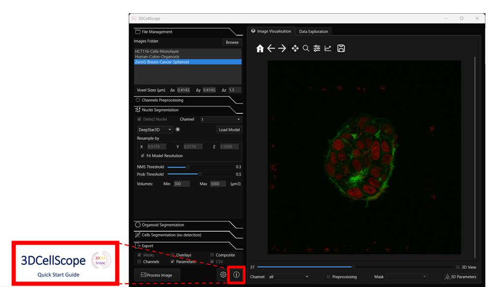

# 3DCELLSCOPE DEMO version     
**3DCELLSCOPE** is a demonstration version of a user friendly software allowing to perform 3D cell segmentation using different pre-trained CNN networks and others state-of-the-art segmentation approaches.

## Overview
By integrating both advanced 3D AI tools and the versatility of user-oriented software under a single software, 3DCellScope bridge the gap between specialized pipelines and generalist commercial software positioning itself as an ideal choice for 3D image analysis of complex biological structure. Furthermore, we provide an interface that allows for the direct integration of other AI networks for nuclei segmentation. This capability facilitates collaborative efforts, acknowledges the rapid evolution of the field, and uniquely empowers users to assess the performance of different AI solutions with a single click.
The package is only compatible with Windows operating systems.

## Documentation
The official documentation, 3DCellScope Quick Start Guide is available inside 3DCellScope.zip folder: 

Examples of usage and troubleshoots can be found following the video folder included 3DCellScope.zip folder.

### System Requirements
Hardware requirements
To make it accessible to a wide range of users, 3DCellScope package can be run on most modern computer with standard specifications and enough RAM to support the in-memory operations. 
Additionally, a moderate amount of available disk space is recommended to accommodate the installation files and any associated data. Overall, the software is designed to be lightweight and efficient, ensuring a seamless user experience without demanding extensive hardware resources.

### Software requirements
#### OS Requirements
The software has been developed and tested exclusively for Windows operating systems. It is not compatible with macOS or Linux.

## Installation Guide
To install the software, just download the 3DCellScope-setup.exe file then follow the prompts instructions to select installation preferences such as destination folder and shortcut.

## License
By downloading or installing the Software, Licensee acknowledges and agrees to be bound by the terms of this Software License Agreement.
This Software License Agreement ("Agreement") is entered into between QuantaCell ("Licensor") and the end user ("Licensee") for the software product known as "3DCellScope" ("Software")

### 1. Grant of License:
Licensor grants Licensee a non-exclusive, non-transferable license to use the Software solely for the purpose of evaluating its capabilities. This license does not grant Licensee any rights to modify, distribute, sublicense, or reverse engineer the Software.

### 2. Restrictions:
Licensee shall not:
•	Reverse engineer, decompile, or disassemble the Software.
•	Modify, adapt, or create derivative works based on the Software.
•	Distribute, sublicense, or transfer the Software or any part thereof to any third party.
•	Use the Software for any commercial purpose.

### 3. Ownership:
Licensor retains all rights, title, and interest in and to the Software, including all intellectual property rights. This Agreement does not convey any ownership rights to Licensee.

### 4. Warranty Disclaimer:
THE SOFTWARE IS PROVIDED "AS IS" WITHOUT WARRANTY OF ANY KIND, EITHER EXPRESS OR IMPLIED, INCLUDING, BUT NOT LIMITED TO, THE IMPLIED WARRANTIES OF MERCHANTABILITY, FITNESS FOR A PARTICULAR PURPOSE, OR NON-INFRINGEMENT.

### 5. Limitation of Liability:
IN NO EVENT SHALL LICENSOR BE LIABLE FOR ANY INCIDENTAL, SPECIAL, INDIRECT, OR CONSEQUENTIAL DAMAGES ARISING OUT OF OR RELATING TO THE USE OR INABILITY TO USE THE SOFTWARE, EVEN IF LICENSOR HAS BEEN ADVISED OF THE POSSIBILITY OF SUCH DAMAGES.

### 6. Term and Termination:
This Agreement shall remain in effect until terminated. Licensor may terminate this Agreement immediately upon written notice if Licensee breaches any provision herein.

### 7. Governing Law:
This Agreement shall be governed by and construed in accordance with the laws of France, and any disputes arising out of or in connection with this Agreement shall be subject to the exclusive jurisdiction of the courts of Montpellier in France.
### 8. Entire Agreement:
This Agreement constitutes the entire agreement between Licensor and Licensee concerning the subject matter hereof and supersedes all prior or contemporaneous agreements, representations, warranties, and understandings.

